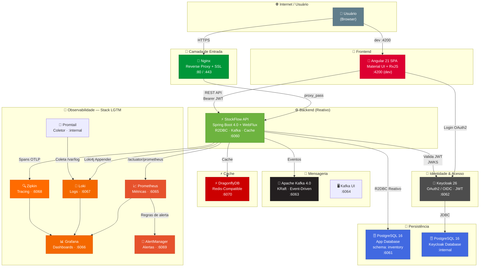
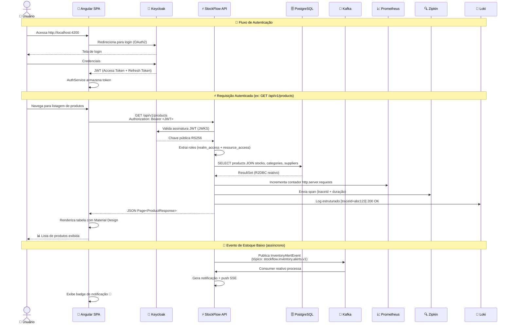
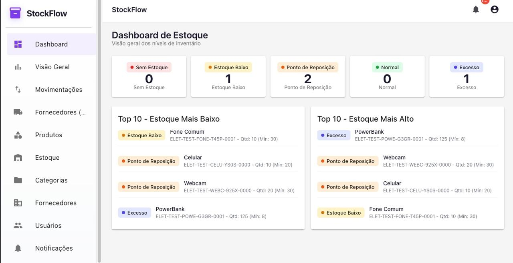

# 🏭 StockFlow — Plataforma Inteligente de Gestão de Estoque

<div align="center">


**~1.000 req/s • p99 < 150ms • Stack Reativa • Observabilidade Completa • RBAC Empresarial**

</div>

---

## 📋 O Ecossistema StockFlow

**StockFlow** é uma plataforma **full-stack corporativa** de gestão de estoque e inventário, projetada para resolver problemas reais de controle de mercadorias em empresas de médio e grande porte.

Diferente de planilhas ou ERPs genéricos, o StockFlow oferece:

- 🎯 **Rastreabilidade total** do ciclo de vida de cada produto no estoque — cada entrada, saída, ajuste ou transferência é registrada com razão documentada e auditável
- 📊 **Dashboards analíticos** que transformam dados brutos em inteligência de negócio: ruptura de estoque, produtos parados, giro de mercadorias e performance por fornecedor
- 🔐 **Controle de acesso empresarial** com RBAC de três níveis (Admin, Gerente, Funcionário), integrado a um servidor IAM dedicado (Keycloak) via OAuth2/OpenID Connect
- ⚡ **Alta performance** com stack 100% reativa (Spring WebFlux + R2DBC), suportando mais de **1.000 requisições/segundo** com latência p99 abaixo de 150ms em endpoints que batem no banco de dados
- 🔭 **Observabilidade de classe mundial** com métricas, logs estruturados e tracing distribuído — tudo centralizado em dashboards no Grafana com alertas configurados
- 📄 **Relatórios em PDF** gerados sob demanda para auditoria e conformidade
- 🔔 **Notificações em tempo real** via SSE (Server-Sent Events) para alertas de estoque crítico
- 🌐 **Arquitetura em contêineres** com 14 serviços orquestrados via Docker Compose, isolados em rede interna, prontos para deploy em cloud

> 💡 **Valor de negócio:** Reduza perdas por ruptura de estoque, elimine retrabalho com planilhas, audite cada movimentação e tome decisões baseadas em dados — tudo em uma única plataforma.

---

## 🏗️ Arquitetura do Ecossistema

O StockFlow é composto por **14 contêineres Docker** que se comunicam em uma rede interna isolada (`stockflow-network`), orquestrados via Docker Compose. A aplicação frontend Angular é servida em desenvolvimento local ou empacotada e distribuída via Nginx em produção.

### 🔷 Visão Geral dos Contêineres



### 🔷 Papel de Cada Contêiner

#### 🎨 Frontend — Angular SPA
| Atributo | Valor |
|----------|-------|
| **Tecnologia** | Angular 21, TypeScript 5.9, Angular Material, RxJS |
| **Porta (dev)** | `4200` |
| **Descrição** | Single Page Application com Lazy Loading modular. Interface responsiva com Material Design, dashboards interativos e componentes standalone. Autenticação delegada ao Keycloak via `keycloak-angular`. Em produção, o build é servido estaticamente pelo Nginx. |

**Diferenciais técnicos:**
- **8 módulos** carregados sob demanda (Lazy Loading): Dashboard, Products, Stocks, Categories, Suppliers, Users, Notifications, Landing
- **Route Guards encadeados** (`AuthGuard` → `RoleGuard`) para proteção granular com hierarquia de roles
- **Interceptors HTTP** que anexam automaticamente o Bearer Token e tratam `401 Unauthorized` com redirecionamento ao login
- **Vitest** para testes unitários de componentes, serviços e pipes

#### ⚡ Backend — Spring Boot API
| Atributo | Valor |
|----------|-------|
| **Tecnologia** | Java 21, Spring Boot 4.0.6, WebFlux, R2DBC, Reactor Kafka |
| **Porta** | `6060` |
| **Descrição** | API REST reativa de alta performance. Stack 100% não-bloqueante de ponta a ponta: Netty → WebFlux → R2DBC/DragonflyDB/Kafka. Processa requisições autenticadas com joins em múltiplas tabelas com latência p99 abaixo de 150ms. |

**Diferenciais técnicos:**
- **Pool de conexões R2DBC** com 50 conexões máximas e 10 iniciais, TTL de 30 minutos
- **Migrations Flyway** versionando o schema `inventory` com 9 arquivos SQL
- **Transactional Outbox Pattern** no Kafka para garantia de entrega de eventos
- **Resilience4j** com Circuit Breaker no cliente ViaCEP (sliding window de 10 chamadas)
- **OpenPDF** para geração de relatórios em PDF (produtos e estoque)
- **SSE (Sinks.Many)** para push de notificações em tempo real com backpressure buffer de 1024 eventos

#### 🗄️ PostgreSQL — Banco de Dados da Aplicação
| Atributo | Valor |
|----------|-------|
| **Imagem** | `postgres:16-alpine` |
| **Porta** | `6061` |
| **Volume** | `postgres_data` (persistente) |
| **Schema** | `inventory` |

Armazena todas as entidades de negócio: usuários (sincronizados do Keycloak), produtos, estoques, categorias, fornecedores, contatos, endereços, movimentações de inventário e notificações. Utiliza enums nativos do PostgreSQL e extensão `uuid-ossp` para geração de UUIDs.

#### 🗄️ PostgreSQL — Banco de Dados do Keycloak
| Atributo | Valor |
|----------|-------|
| **Imagem** | `postgres:16-alpine` |
| **Porta** | Interna (apenas na rede Docker) |
| **Volume** | `postgres_keycloak_data` (persistente) |

Instância dedicada e isolada para os dados de identidade do Keycloak (realms, clients, usuários, credenciais, sessões).

#### 🔐 Keycloak — Identity & Access Management
| Atributo | Valor |
|----------|-------|
| **Imagem** | `quay.io/keycloak/keycloak:26.0` |
| **Porta** | `6062` |
| **Tema Customizado** | `themes/stockflow` (branding próprio) |

Servidor IAM completo com:
- **Realm dedicado:** `stock-flow-realm`
- **Client OAuth2:** `stock-flow-app` (frontend) e `stock-flow-api` (backend)
- **RBAC:** Roles `USER`, `MANAGER`, `ADMIN` mapeadas nos claims JWT
- **Fluxo:** Authorization Code (frontend) + Client Credentials (backend admin)
- **Integração:** Frontend autentica via `keycloak-angular`, backend valida JWTs via Spring Security OAuth2 Resource Server (JWKS)

#### 🚌 Apache Kafka — Mensageria
| Atributo | Valor |
|----------|-------|
| **Imagem** | `apache/kafka:4.0.0` |
| **Porta** | `6063` |
| **UI** | Kafbat Kafka UI em `6064` |

Broker único em modo KRaft (sem ZooKeeper). Tópico principal: `stockflow.inventory.alerts.v1` para eventos de alerta de estoque. Producers e consumers implementados com `reactor-kafka` (stack reativa). O Kafka UI permite inspecionar mensagens, tópicos e consumer groups durante o desenvolvimento.

#### ⚡ DragonflyDB — Cache Distribuído
| Atributo | Valor |
|----------|-------|
| **Imagem** | `ghcr.io/dragonflydb/dragonfly:v1.37.0` |
| **Porta** | `6070` |

Substituto drop-in do Redis com performance superior. Armazena:
- **Cache de dashboards** com TTL de 30 minutos (métricas de estoque, movimentações e fornecedores)
- **Serialização JSON** via `GenericJacksonJsonRedisSerializer` com ObjectMapper customizado

#### 🔭 Stack de Observabilidade — LGTM (Loki, Grafana, Tempo/Mimir, Prometheus)

| Contêiner | Porta | Função |
|-----------|-------|--------|
| **Prometheus** | `6065` | Coleta métricas do endpoint `/actuator/prometheus` a cada 15s. Retenção de 15 dias. |
| **Loki** | `6067` | Agregação de logs estruturados em JSON com labels indexáveis (`application`, `host`, `level`) |
| **Promtail** | Interna | Coleta logs do sistema (`/var/log/*log`) e envia ao Loki |
| **Zipkin** | `6068` | Tracing distribuído via exportador OpenTelemetry. Sampling de 100% em desenvolvimento. |
| **Grafana** | `6066` | Dashboards provisionados automaticamente com Prometheus (métricas) e Loki (logs) como datasources |
| **AlertManager** | `6069` | Roteamento de alertas com 4 regras configuradas: API fora do ar, alta taxa de erros 5xx, Kafka sem eventos, e produtos em ruptura |

> 🔗 **Rastreabilidade completa:** Cada requisição gera um `traceId` que aparece nos logs (via MDC), é enviado ao Zipkin como span e pode ser correlacionado com as métricas do Prometheus — tudo visualizável lado a lado no Grafana.

#### 🔀 Nginx — Reverse Proxy
| Atributo | Valor |
|----------|-------|
| **Imagem** | `nginx:1.26-bookworm` |
| **Portas** | `80` (HTTP) / `443` (HTTPS) |

Proxy reverso com:
- **Rate limiting** (`limit_req`) com burst de 20 requisições
- **Gzip** habilitado para JSON, CSS e JavaScript
- **Headers de segurança:** `X-Frame-Options`, `X-Content-Type-Options`, `X-XSS-Protection`, `Referrer-Policy`
- **Timeouts** configurados: 60s para connect, send e read

---

## 🌐 Arquitetura de Rede

Toda a comunicação entre os contêineres ocorre dentro da **rede Docker interna** `stockflow-network` (bridge), garantindo:

- 🔒 **Isolamento total** — apenas as portas explicitamente mapeadas (`6060`–`6070`, `80`, `443`) são expostas ao host
- 🔐 **Comunicação interna segura** — serviços se referenciam por hostname (ex: `stockflow-api`, `keycloak`, `kafka`) sem expor portas desnecessárias
- 📦 **Resolução DNS automática** — o Docker Compose gerencia a descoberta de serviços via nomes de contêiner
- 🏥 **Health checks** — PostgreSQL e DragonflyDB possuem health checks que condicionam a inicialização dos serviços dependentes

```
Rede externa (host)              Rede interna (stockflow-network)
─────────────────────────────────────────────────────────────────────
 localhost:80   ──────────►  nginx:80
 localhost:4200 ──────────►  angular dev server (opcional)
 localhost:6060 ──────────►  stockflow-api:6060
 localhost:6062 ──────────►  keycloak:8080
 localhost:6061 ──► postgres:5432 (app DB)
 localhost:6063 ──► kafka:9092
 localhost:6064 ──► kafka-ui:8080
 localhost:6065 ──► prometheus:9090
 localhost:6066 ──► grafana:3000
 localhost:6067 ──► loki:3100
 localhost:6068 ──► zipkin:9411
 localhost:6069 ──► alertmanager:9093
 localhost:6070 ──► dragonfly:6379
                │
       stockflow-network (bridge)
       ┌──────────────────────────────────────────┐
       │  serviços se comunicam por hostname       │
       │  sem exposição externa                    │
       └──────────────────────────────────────────┘
```

---

## 🚀 Quick Start — Rodando Tudo em 3 Minutos

### Pré-requisitos

- **Docker** `24+` e **Docker Compose** `2.20+`
- **Node.js** `20+` e **npm** `10+` (apenas para desenvolvimento do frontend)
- **Git**

### 1. Clone o repositório

```bash
git clone git@github.com:GustavoSDaniel/StockFlow.git
cd StockFlow
```

### 2. Configure o ambiente

```bash
cd stockflow-api
cp variaveis-de-ambiente.example.env .env
# Edite o .env com suas credenciais (as padrão já funcionam para dev local)
```

### 3. Suba toda a stack backend + infra

```bash
docker compose up -d
```

**14 contêineres** serão iniciados automaticamente. Aguarde ~60 segundos para todos ficarem saudáveis:

```
✔ Network stockflow-network     Created
✔ Container db-keycloak         Healthy
✔ Container db-stockflow        Healthy
✔ Container keycloak            Started
✔ Container kafka               Started
✔ Container dragonfly           Healthy
✔ Container stockflow-api       Started
✔ Container prometheus          Started
✔ Container loki                Started
✔ Container promtail            Started
✔ Container zipkin              Started
✔ Container alertmanager        Started
✔ Container grafana             Started
✔ Container kafka-ui            Started
✔ Container nginx               Started
```

### 4. (Opcional) Inicie o frontend Angular

```bash
cd ../stockflow-frontend
npm install
npm start
# Acesse: http://localhost:4200
```

---

## 🔌 Portas e Acessos

| Serviço | Porta | URL | Credenciais |
|---------|-------|-----|-------------|
| **Frontend (Angular)** | `4200` | http://localhost:4200 | Login via Keycloak |
| **API (Spring Boot)** | `6060` | http://localhost:6060 | JWT Bearer Token |
| **Swagger UI** | `6060` | http://localhost:6060/swagger-ui.html | — |
| **Keycloak** | `6062` | http://localhost:6062 | `admin` / `admin` |
| **Kafka UI** | `6064` | http://localhost:6064 | — |
| **Prometheus** | `6065` | http://localhost:6065 | — |
| **Grafana** | `6066` | http://localhost:6066 | `admin` / `admin` |
| **Loki** | `6067` | http://localhost:6067 | — |
| **Zipkin** | `6068` | http://localhost:6068 | — |
| **AlertManager** | `6069` | http://localhost:6069 | — |
| **PostgreSQL (app)** | `6061` | `localhost:6061` | Definido no `.env` |

### Verificação rápida

```bash
# Health check da API
curl http://localhost:6060/actuator/health

# Métricas Prometheus
curl http://localhost:6060/actuator/prometheus | head -20

# Status Docker
docker compose ps
```

---

## 📊 Diagrama de Fluxo de uma Requisição



---

## ⚡ Performance Comprovada

> Resultados de teste de estresse com **k6** — 50 usuários virtuais simultâneos durante 30 segundos.

| Métrica | Resultado |
|---------|-----------|
| **Throughput** | ~1.000 requisições/segundo |
| **p(99) Latência** | < 150ms |
| **p(95) Latência** | < 100ms |
| **Taxa de Sucesso** | 100% (zero falhas) |
| **Cenário** | `GET /api/v1/products` autenticado com joins em 4 tabelas |

> ⚡ A stack reativa (WebFlux + R2DBC + DragonflyDB) entrega performance de ponta mesmo em cenários de alto estresse com autenticação JWT completa e consultas complexas ao banco de dados.

---

## 📸 Screenshots

### 🎨 Painel Administrativo

<div align="center">



*Tela principal do sistema StockFlow — gestão completa de estoque, produtos, fornecedores e dashboards analíticos.*

</div>

### 📊 Observabilidade & Testes de Carga

> *Espaço reservado para capturas dos dashboards Grafana, tracing no Zipkin e resultados de teste de carga com k6.*

| | |
|---|---|
| **Métricas da API (Prometheus)** | **Logs Estruturados (Loki)** |
| *Área reservada para screenshot* | *Área reservada para screenshot* |
| **Tracing Distribuído (Zipkin)** | **Grafana durante teste de estresse** |
| *Área reservada para screenshot* | *Área reservada para screenshot* |

---

## 🧱 Estrutura do Repositório

```
StockFlow/                           # 🏭 Raiz do monorepo
├── README.md                        # 👈 Você está aqui
├── LICENSE                          # Apache 2.0
│
├── stockflow-api/                   # ⚡ Backend Java (Spring Boot)
│   ├── pom.xml                      # Maven — 25+ dependências
│   ├── docker-compose.yml           # 14 contêineres orquestrados
│   ├── dockerfile                   # Build multi-stage (Maven → JRE)
│   ├── teste-carga.js               # Script k6 para estresse
│   ├── docker/                      # Configs da stack de observabilidade
│   │   ├── prometheus/              # prometheus.yml + alerts.yml
│   │   ├── promtail/                # promtail.yml
│   │   ├── grafana/provisioning/    # Dashboards e datasources
│   │   └── alertmanager/            # alertmanager.yml
│   ├── nginx/                       # Reverse proxy (SSL, rate limit)
│   ├── themes/stockflow/            # Tema customizado Keycloak
│   └── src/main/java/.../           # Código-fonte (35+ classes)
│       ├── config/                  # Security, R2DBC, Kafka, Cache, etc.
│       ├── controller/              # 8 Controllers REST reativos
│       ├── service/                 # 12 Services de negócio
│       ├── repository/              # 10 Repositories R2DBC
│       └── messaging/               # Kafka (producer, consumer, outbox)
│
└── stockflow-frontend/              # 🎨 Frontend SPA (Angular 21)
    ├── package.json                 # Angular 21, Material, Keycloak
    ├── angular.json                 # Angular CLI config
    └── src/app/
        ├── core/                    # Auth, HTTP interceptors, models, services
        ├── features/                # 8 módulos com Lazy Loading
        │   ├── dashboard/           # 4 dashboards analíticos
        │   ├── products/            # CRUD completo de produtos
        │   ├── stocks/              # Gestão de estoque e movimentações
        │   ├── suppliers/           # Fornecedores e contatos
        │   ├── categories/          # Categorias hierárquicas
        │   ├── users/               # Administração de usuários
        │   ├── notifications/       # Central de notificações
        │   └── landing/             # Landing page pública
        └── shared/                  # Componentes reutilizáveis (DataTable, etc.)
```

---

## 📚 Leitura Complementar

- [📦 StockFlow API — Documentação completa do backend](stockflow-api/README.md)
- [🎨 StockFlow Frontend — Documentação do painel administrativo](stockflow-frontend/README.md)

---

## 📄 Licença

Este projeto está licenciado sob a **Apache License 2.0**. Consulte o arquivo [LICENSE](LICENSE) para mais detalhes.

---

<div align="center">

**StockFlow** — Do estoque ao insight, em tempo real.

Feito com por **[Gustavo Silva Daniel](mailto:gustavosdaniel@hotmail.com)**

[](https://github.com/GustavoSDaniel)

</div>
