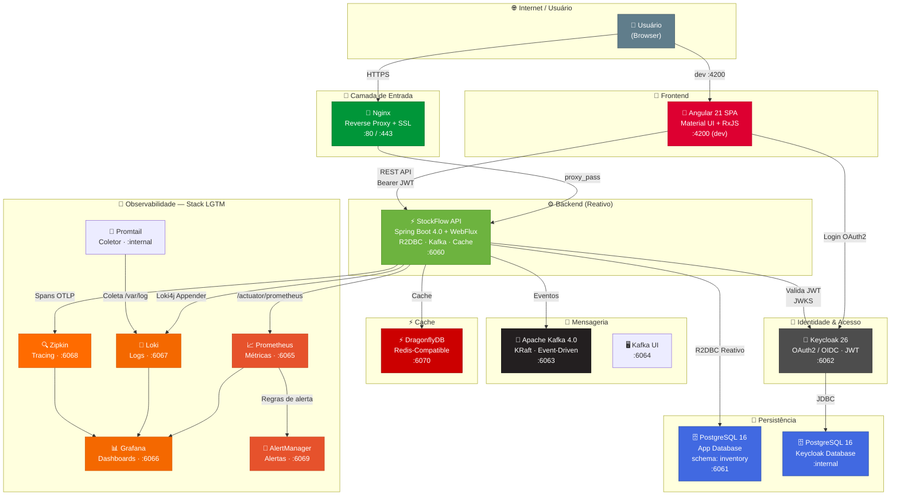
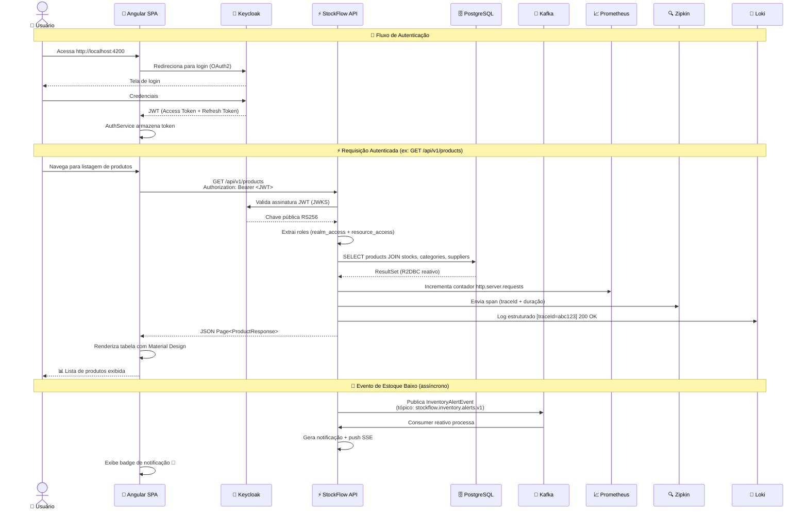

# 🏭 StockFlow — Plataforma Inteligente de Gestão de Estoque

<div align="center">


**~1.000 req/s • p99 < 150ms • Stack Reativa • Observabilidade Completa • RBAC Empresarial**

</div>

---

## 📋 O Ecossistema StockFlow

**StockFlow** é uma plataforma **full-stack corporativa** de gestão de estoque e inventário, projetada para resolver problemas reais de controle de mercadorias em empresas de médio e grande porte.

Diferente de planilhas ou ERPs genéricos, o StockFlow oferece:

- 🎯 **Rastreabilidade total** do ciclo de vida de cada produto no estoque — cada entrada, saída, ajuste ou transferência é registrada com razão documentada e auditável
- 📊 **Dashboards analíticos** que transformam dados brutos em inteligência de negócio: ruptura de estoque, produtos parados, giro de mercadorias e performance por fornecedor
- 🔐 **Controle de acesso empresarial** com RBAC de três níveis (`EMPLOYEE`, `MANAGER`, `ADMIN`), integrado a um servidor IAM dedicado (Keycloak) via OAuth2/OpenID Connect
- ⚡ **Alta performance** com stack 100% reativa (Spring WebFlux + R2DBC), suportando mais de **1.000 requisições/segundo** com latência p99 abaixo de 150ms em endpoints com joins no banco
- 🔭 **Observabilidade de classe mundial** com métricas, logs estruturados e tracing distribuído — centralizados em dashboards no Grafana com alertas configurados
- 📄 **Relatórios em PDF** gerados sob demanda para auditoria e conformidade
- 🔔 **Notificações em tempo real** via SSE (Server-Sent Events) para alertas de estoque crítico
- 🌐 **Arquitetura em contêineres** com 14 serviços orquestrados via Docker Compose, isolados em rede interna, prontos para deploy em cloud

> 💡 **Valor de negócio:** Reduza perdas por ruptura de estoque, elimine retrabalho com planilhas, audite cada movimentação e tome decisões baseadas em dados — tudo em uma única plataforma.

---

## 🏗️ Arquitetura da Solução

O StockFlow segue uma arquitetura de **três camadas lógicas** com comunicação segura via OAuth2/OIDC e deploy em contêineres:

```
┌──────────────────────────────────────────────────────────────────────┐
│                        CAMADA DE APRESENTAÇÃO                        │
│                                                                      │
│  ┌──────────────────────────────┐    ┌────────────────────────────┐  │
│  │   Angular 21 SPA             │    │   Nginx (produção)         │  │
│  │   • Lazy Loading (8 módulos) │    │   • Proxy reverso          │  │
│  │   • Angular Material UI      │    │   • SSL/TLS (Let's Encrypt)│  │
│  │   • Route Guards (auth+role) │    │   • Rate limiting          │  │
│  │   • HTTP Interceptors (JWT)  │    │   • Serve arquivos staticos│  │
│  └──────────────┬───────────────┘    └─────────────┬──────────────┘  │
│                 │                                  │                 │
└─────────────────┼──────────────────────────────────┼─────────────────┘
                  │                                  │
          dev: localhost:4200              prod: api.stockflow...
                  │                                  │
┌─────────────────┼──────────────────────────────────┼─────────────────┐
│                 │        CAMADA DE SERVIÇOS        │                 │
│                 ▼                                  ▼                 │
│  ┌──────────────────────────────────────────────────────────────┐    │
│  │                    StockFlow API (Spring Boot 4.0)           │    │
│  │                    WebFlux · R2DBC · Reactor Kafka · SSE    │    │
│  │                                                              │    │
│  │  ┌──────────┐ ┌──────────┐ ┌──────────┐ ┌───────────────┐  │    │
│  │  │ Users    │ │ Products │ │ Stocks   │ │ Suppliers     │  │    │
│  │  │ Service  │ │ Service  │ │ Service  │ │ Service       │  │    │
│  │  └──────────┘ └──────────┘ └──────────┘ └───────────────┘  │    │
│  │  ┌──────────┐ ┌──────────┐ ┌──────────┐ ┌───────────────┐  │    │
│  │  │Category  │ │Movement  │ │Dashboard │ │Notification   │  │    │
│  │  │ Service  │ │ Service  │ │ Service  │ │ Service       │  │    │
│  │  └──────────┘ └──────────┘ └──────────┘ └───────────────┘  │    │
│  │                                                              │    │
│  │  ┌──────────────────────────────────────────────────────┐    │    │
│  │  │  KeycloakService (Admin Client)                       │    │    │
│  │  │  • Client Credentials Grant → Service Account         │    │    │
│  │  │  • Gerencia roles de usuários no Keycloak            │    │    │
│  │  │  • Isolado em Schedulers.boundedElastic()            │    │    │
│  │  └──────────────────────────────────────────────────────┘    │    │
│  └──────────────────────────────────────────────────────────────┘    │
└──────────────────────────────────────────────────────────────────────┘
                                   │
                                   │
┌──────────────────────────────────┼──────────────────────────────────┐
│                    CAMADA DE INFRAESTRUTURA                          │
│                                                                      │
│  ┌──────────┐ ┌──────────┐ ┌──────────┐ ┌──────────┐ ┌──────────┐  │
│  │ Keycloak │ │ Postgres │ │  Kafka   │ │Dragonfly │ │  Nginx   │  │
│  │  :6062   │ │  :6061   │ │  :6063   │ │  :6070   │ │ :80/:443 │  │
│  └──────────┘ └──────────┘ └──────────┘ └──────────┘ └──────────┘  │
│  ┌──────────┐ ┌──────────┐ ┌──────────┐ ┌──────────┐ ┌──────────┐  │
│  │Prometheus│ │  Loki    │ │  Zipkin  │ │ Grafana  │ │AlertMgr  │  │
│  │  :6065   │ │  :6067   │ │  :6068   │ │  :6066   │ │  :6069   │  │
│  └──────────┘ └──────────┘ └──────────┘ └──────────┘ └──────────┘  │
│                                                                      │
│  Todos isolados na rede Docker interna: stockflow-network            │
└──────────────────────────────────────────────────────────────────────┘
```

### 🔷 Como as três peças se comunicam

O StockFlow é uma aplicação **OAuth2-native**. Toda comunicação entre o frontend, o backend e os serviços de infraestrutura passa pelo Keycloak como autoridade central de identidade.

#### 1. Frontend (Angular) ↔ Keycloak

O frontend **nunca manipula credenciais**. Todo o fluxo de autenticação é delegado:

```
Usuário → Angular SPA → redireciona para Keycloak → tela de login
                                                         │
                                    ┌────────────────────┘
                                    ▼
                        Keycloak valida credenciais
                        Emite JWT (Access + Refresh Token)
                                    │
                                    ▼
                        Angular armazena tokens em memória
                        (keycloak-angular + keycloak-js)
```

- **Biblioteca**: `keycloak-angular` — encapsula o fluxo OAuth2 Authorization Code com PKCE
- **Route Guards**: `AuthGuard` (exige autenticação) → `RoleGuard` (exige role mínima)
- **HTTP Interceptor**: anexa automaticamente `Authorization: Bearer <jwt>` em todas as requisições
- **Roles no JWT**: claims `realm_access.roles` (ex: `["employee", "manager"]`) + `resource_access.stock-flow-app.roles`

#### 2. Backend (Spring Boot) ↔ Keycloak

O backend usa **duas formas distintas** de interagir com o Keycloak:

| Modo | Tipo de Token | Propósito |
|---|---|---|
| **Resource Server** | Valida JWT do usuário final | Autorizar requisições HTTP (Spring Security) |
| **Admin Client** | Client Credentials (Service Account) | Gerenciar roles de usuários (server-to-server) |

**Resource Server** — A cada requisição, o Spring Security:
1. Extrai o JWT do header `Authorization`
2. Valida a assinatura RS256 contra o JWKS endpoint do Keycloak
3. Extrai roles do claim `realm_access` + `resource_access`
4. Converte para `GrantedAuthority` com prefixo `ROLE_` (ex: `ROLE_MANAGER`)
5. Aplica as regras do `SecurityWebFilterChain` (`.hasRole("MANAGER")`, etc.)

**Admin Client** — Quando um Manager promove um usuário:
1. `KeycloakService` autentica com `client_id` + `client_secret` (Client Credentials)
2. Obtém um token de acesso administrativo
3. Chama a Admin REST API do Keycloak para atribuir/remover realm roles
4. Tudo roda em `Schedulers.boundedElastic()` para não bloquear o event loop

#### 3. Frontend ↔ Backend

Toda comunicação é via **REST/JSON sobre HTTPS**, autenticada com JWT:

```
Angular (HttpClient + Interceptor)
    │
    │  GET/POST/PUT/PATCH/DELETE
    │  Authorization: Bearer <jwt>
    │  Content-Type: application/json
    │
    ▼
Spring Boot (WebFlux Controllers)
    │
    │  Spring Security valida JWT → extrai roles
    │  Controller delega para Service
    │  Service executa lógica de negócio
    │  Repository (R2DBC) persiste no PostgreSQL
    │
    ▼
Resposta JSON (Mono<T> ou Flux<T>)
```

**Canais especiais:**
- **SSE (Server-Sent Events)**: `GET /api/v1/notifications/stream` — stream unidirecional de notificações em tempo real. O Nginx é configurado com `proxy_buffering off` para essa rota.
- **PDF**: `GET /api/v1/products/report` e `GET /api/v1/stocks/report` — geração server-side com OpenPDF, retorna `application/pdf`.

---

### 🔷 Diagrama de Contêineres (Mermaid)



### 🔷 Papel de Cada Contêiner

#### 🎨 Frontend — Angular SPA
| Atributo | Valor |
|----------|-------|
| **Tecnologia** | Angular 21, TypeScript 5.9, Angular Material, RxJS |
| **Porta (dev)** | `4200` |
| **Descrição** | Single Page Application com Lazy Loading modular. Interface responsiva com Material Design, dashboards interativos e componentes standalone. Autenticação delegada ao Keycloak via `keycloak-angular`. Em produção, o build é servido estaticamente pelo Nginx. |

**Diferenciais técnicos:**
- **8 módulos** carregados sob demanda (Lazy Loading): Dashboard, Products, Stocks, Categories, Suppliers, Users, Notifications, Landing
- **Route Guards encadeados** (`AuthGuard` → `RoleGuard`) para proteção granular com hierarquia de roles
- **Interceptors HTTP** que anexam automaticamente o Bearer Token e tratam `401 Unauthorized` com redirecionamento ao login
- **Vitest** para testes unitários de componentes, serviços e pipes

#### ⚡ Backend — Spring Boot API
| Atributo | Valor |
|----------|-------|
| **Tecnologia** | Java 21, Spring Boot 4.0.6, WebFlux, R2DBC, Reactor Kafka |
| **Porta** | `6060` |
| **Descrição** | API REST reativa de alta performance. Stack 100% não-bloqueante de ponta a ponta: Netty → WebFlux → R2DBC/DragonflyDB/Kafka. Processa requisições autenticadas com joins em múltiplas tabelas com latência p99 abaixo de 150ms. |

**Diferenciais técnicos:**
- **Pool de conexões R2DBC** com 50 conexões máximas e 10 iniciais, TTL de 30 minutos
- **Migrations Flyway** versionando o schema `inventory` com 9 arquivos SQL
- **Transactional Outbox Pattern** no Kafka para garantia de entrega de eventos
- **Resilience4j** com Circuit Breaker no cliente ViaCEP (sliding window de 10 chamadas)
- **OpenPDF** para geração de relatórios em PDF (produtos e estoque)
- **SSE (Sinks.Many)** para push de notificações em tempo real com backpressure buffer de 1024 eventos

#### 🗄️ PostgreSQL — Banco de Dados da Aplicação
| Atributo | Valor |
|----------|-------|
| **Imagem** | `postgres:16-alpine` |
| **Porta** | `6061` |
| **Volume** | `postgres_data` (persistente) |
| **Schema** | `inventory` |

Armazena todas as entidades de negócio: usuários (sincronizados do Keycloak), produtos, estoques, categorias, fornecedores, contatos, endereços, movimentações de inventário e notificações. Utiliza enums nativos do PostgreSQL e extensão `uuid-ossp` para geração de UUIDs.

#### 🗄️ PostgreSQL — Banco de Dados do Keycloak
| Atributo | Valor |
|----------|-------|
| **Imagem** | `postgres:16-alpine` |
| **Porta** | Interna (apenas na rede Docker) |
| **Volume** | `postgres_keycloak_data` (persistente) |

Instância dedicada e isolada para os dados de identidade do Keycloak (realms, clients, usuários, credenciais, sessões).

#### 🔐 Keycloak — Identity & Access Management
| Atributo | Valor |
|----------|-------|
| **Imagem** | `quay.io/keycloak/keycloak:26.0` |
| **Porta** | `6062` |
| **Tema Customizado** | `infra/keycloak/themes/stockflow` (branding próprio) |

Servidor IAM completo com:
- **Realm dedicado:** `stock-flow-realm`
- **Clients OAuth2:** `stock-flow-app` (frontend, público) e `stock-flow-api` (backend, confidencial com Service Account)
- **RBAC:** Roles `employee`, `manager`, `admin` mapeadas nos claims JWT
- **Fluxo:** Authorization Code + PKCE (frontend) + Client Credentials (backend admin)
- **Integração:** Frontend autentica via `keycloak-angular`, backend valida JWTs via Spring Security OAuth2 Resource Server (JWKS)

#### 🚌 Apache Kafka — Mensageria
| Atributo | Valor |
|----------|-------|
| **Imagem** | `apache/kafka:4.0.0` |
| **Porta** | `6063` |
| **UI** | Kafbat Kafka UI em `6064` |

Broker único em modo KRaft (sem ZooKeeper). Tópico principal: `stockflow.inventory.alerts.v1` para eventos de alerta de estoque. Producers e consumers implementados com `reactor-kafka` (stack reativa). O Kafka UI permite inspecionar mensagens, tópicos e consumer groups durante o desenvolvimento.

#### ⚡ DragonflyDB — Cache Distribuído
| Atributo | Valor |
|----------|-------|
| **Imagem** | `ghcr.io/dragonflydb/dragonfly:v1.37.0` |
| **Porta** | `6070` |

Substituto drop-in do Redis com performance superior. Armazena:
- **Cache de dashboards** com TTL de 30 minutos (métricas de estoque, movimentações e fornecedores)
- **Serialização JSON** via `GenericJacksonJsonRedisSerializer` com ObjectMapper customizado

#### 🔭 Stack de Observabilidade — LGTM + Zipkin

| Contêiner | Porta | Função |
|-----------|-------|--------|
| **Prometheus** | `6065` | Coleta métricas do endpoint `/actuator/prometheus` a cada 15s. Retenção de 15 dias. |
| **Loki** | `6067` | Agregação de logs estruturados em JSON com labels indexáveis (`application`, `host`, `level`) |
| **Promtail** | Interna | Coleta logs do sistema (`/var/log/*log`) e envia ao Loki |
| **Zipkin** | `6068` | Tracing distribuído via exportador OpenTelemetry. Sampling de 100% em desenvolvimento. |
| **Grafana** | `6066` | Dashboards provisionados automaticamente com Prometheus (métricas) e Loki (logs) como datasources |
| **AlertManager** | `6069` | Roteamento de alertas com 4 regras configuradas: API fora do ar, alta taxa de erros 5xx, Kafka sem eventos, e produtos em ruptura |

> 🔗 **Rastreabilidade completa:** Cada requisição gera um `traceId` que aparece nos logs (via MDC), é enviado ao Zipkin como span e pode ser correlacionado com as métricas do Prometheus — tudo visualizável lado a lado no Grafana.

#### 🔀 Nginx — Reverse Proxy
| Atributo | Valor |
|----------|-------|
| **Imagem** | `nginx:1.26-bookworm` |
| **Portas** | `80` (HTTP) / `443` (HTTPS) |

Proxy reverso com:
- **Rate limiting** (`limit_req`) com burst de 20 requisições
- **Gzip** habilitado para JSON, CSS e JavaScript
- **Headers de segurança:** `X-Frame-Options`, `X-Content-Type-Options`, `X-XSS-Protection`, `Referrer-Policy`
- **Roteamento especializado**: `/auth/` → Keycloak, `/api/v1/notifications/stream` → SSE sem buffering, demais rotas → API

---

## ☁️ Infraestrutura e Deploy

> O StockFlow é implantado em uma instância **AWS EC2 t3.medium** (2 vCPU, 4 GB RAM) rodando **Ubuntu 24.04 LTS**, utilizando **Docker Compose** como orquestrador de contêineres em produção.

### 🔷 Arquitetura de Produção

```
                              Internet
                                  │
                                  ▼
                         ┌────────────────┐
                         │   Cloudflare   │
                         │  (DNS + Proxy) │
                         └───────┬────────┘
                                 │
                                 ▼
                   ┌─────────────────────────────────┐
                   │  AWS EC2 — t3.medium (4 GB RAM) │
                   │  Ubuntu 24.04 LTS               │
                   │                                 │
                   │  ┌───────────────────────────┐  │
                   │  │  Nginx :80 / :443         │  │
                   │  │  • Proxy reverso          │  │
                   │  │  • SSL via Certbot        │  │
                   │  │  • Rate limiting (10 r/s) │  │
                   │  │  • SSE pass-through       │  │
                   │  └──────────┬────────────────┘  │
                   │             │                   │
                   │  ┌──────────▼────────────────┐  │
                   │  │  stockflow-api :6060       │  │
                   │  │  • Imagem Docker Hub       │  │
                   │  │  • -Xmx350m (JVM)          │  │
                   │  │  • Profile: docker          │  │
                   │  └──────────┬────────────────┘  │
                   │             │                   │
                   │  ┌──────────▼────────────────┐  │
                   │  │  Docker Compose Network    │  │
                   │  │  ┌───────┐ ┌───────────┐  │  │
                   │  │  │  PG   │ │ Keycloak  │  │  │
                   │  │  │ 200MB │ │  400MB    │  │  │
                   │  │  └───────┘ └───────────┘  │  │
                   │  │  ┌───────┐ ┌───────────┐  │  │
                   │  │  │ Kafka │ │DragonflyDB│  │  │
                   │  │  │ 400MB │ │  700MB    │  │  │
                   │  │  └───────┘ └───────────┘  │  │
                   │  └───────────────────────────┘  │
                   └─────────────────────────────────┘
```

### 🔷 Por que Docker Compose em produção?

A escolha por Docker Compose (em vez de Kubernetes ou ECS) é deliberada:

| Critério | Motivo |
|---|---|
| **Escala do projeto** | Aplicação monolítica com serviços de suporte — não requer orquestração de múltiplas réplicas |
| **Simplicidade operacional** | `docker compose up -d` vs. dezenas de manifests YAML ou configurações de cloud |
| **Custo** | Uma única EC2 t3.medium (~$30/mês reservada) vs. ECS/EKS que exigiriam load balancers, NAT gateways e múltiplas AZs |
| **Portabilidade** | Mesmo `docker-compose.yml` (com overrides) roda localmente e em produção — sem vendor lock-in |
| **Resource limits** | O Compose v2 suporta `deploy.resources.limits.memory` para controle preciso por contêiner |

### 🔷 Limites de Recursos (EC2 t3.medium — 4 GB RAM)

Cada contêiner tem limites de memória definidos no `docker-compose.prod.yml`:

| Serviço | Limite de Memória | JVM / Runtime | Justificativa |
|---|---|---|---|
| **stockflow-api** | 450 MB | `-Xmx350m` + overhead Netty | Heap de 350 MB + metaspace + threads Netty |
| **PostgreSQL (app)** | 200 MB | `shared_buffers` padrão | Apenas uma aplicação conectada |
| **PostgreSQL (Keycloak)** | 150 MB | `shared_buffers` padrão | Uso leve: users, roles, sessions |
| **Keycloak** | 400 MB | Quarkus JVM | Overhead do Quarkus + cache de sessões |
| **Kafka** | 400 MB | `-Xmx256m` | Broker único em modo KRaft |
| **DragonflyDB** | 700 MB | `--maxmemory=600mb` | Cache 100% em memória |
| **Nginx** | 50 MB | — | Proxy reverso leve, sem caching de arquivos |

> **Total alocado:** ~2.35 GB para contêineres, restando ~1.65 GB para o sistema operacional, buffers de I/O e folga para picos.

### 🔷 Estrutura de Diretórios na EC2

```
/home/ubuntu/stockflow/
├── docker-compose.prod.yml         # Compose de produção com resource limits
├── .env                             # Variáveis sensíveis (não versionado)
├── infra/
│   ├── nginx/
│   │   └── conf.d/
│   │       ├── stockflow.conf       # Virtual host + proxy reverso + SSL
│   │       └── nginx.conf           # Configuração global do Nginx
│   └── keycloak/
│       └── themes/
│           └── stockflow/           # Tema customizado do login
└── certbot/
    └── www/                         # Desafios HTTP do Let's Encrypt
```

### 🔷 Configuração do Nginx em Produção

O Nginx atua como **ponto único de entrada**, roteando tráfego por path:

```
                    ┌──────────────────────────────┐
                    │  Nginx (api.stockflow...)     │
                    │                              │
  /auth/* ──────────┤  proxy_pass → keycloak:8080  │
  /api/v1/notifi    │                              │
    cations/stream ─┤  proxy_pass → api:6060       │
                    │  (proxy_buffering off)        │
  /* ───────────────┤  proxy_pass → api:6060       │
                    │  (rate limit: 10 r/s)         │
                    └──────────────────────────────┘
```

**Destaques da configuração:**
- **SSL/TLS**: Certificados Let's Encrypt renovados automaticamente via Certbot
- **SSE pass-through**: Rota `/api/v1/notifications/stream` com `proxy_buffering off` para streaming em tempo real
- **Rate limiting**: 10 requisições/segundo com burst de 20 — proteção contra brute-force sem impactar usuários legítimos
- **Resolver interno**: Usa o DNS do Docker (`127.0.0.11`) para resolver hostnames dos contêineres

### 🔷 docker-compose.prod.yml — Diferenças do Ambiente Local

| Recurso | Local (dev) | Produção (EC2) |
|---|---|---|
| **stockflow-api** | `build: .` (build local) | `image: gustavosdaniel/stockflow-api:latest` (Docker Hub) |
| **Keycloak** | `start-dev` | `start --proxy-headers forwarded` com `KC_HOSTNAME` |
| **Keycloak path** | `/` | `/auth` (HTTP relative path) |
| **Nginx** | Sem SSL (dev local) | Com SSL (Certbot + Let's Encrypt) |
| **Resource limits** | Não configurados | `deploy.resources.limits.memory` em todos os serviços |
| **Kafka UI** | Presente (`:6064`) | Removido (não exposto em produção) |
| **Grafana / Prometheus** | Presente | Removido (stack de observabilidade separada) |
| **Loki / Promtail** | Presente | Desativado (`LOKI_URL=http://desativado`) |
| **Zipkin** | Presente | Removido (tracing desativado em produção) |
| **JVM da API** | Sem limites | `JAVA_OPTS=-Xmx350m -Xms200m` |
| **CORS** | `localhost:4200` | `stockflow.gustavosdaniel.com` |

### 🔷 Fluxo de Deploy

```bash
# 1. Build local da imagem (no diretório stockflow-api/)
./mvnw clean package -DskipTests
docker build -t gustavosdaniel/stockflow-api:latest .

# 2. Push para o Docker Hub
docker push gustavosdaniel/stockflow-api:latest

# 3. Na EC2: pull da nova imagem e restart
ssh ubuntu@api.stockflow.gustavosdaniel.com
cd /home/ubuntu/stockflow
docker compose -f docker-compose.prod.yml pull stockflow-api
docker compose -f docker-compose.prod.yml up -d stockflow-api

# 4. Verificar health
curl -s https://api.stockflow.gustavosdaniel.com/actuator/health | jq .
```

### 🔷 Domínios e Rotas em Produção

| URL | Serviço | Acesso |
|---|---|---|
| `https://stockflow.gustavosdaniel.com` | Frontend Angular (SPA) | Público |
| `https://api.stockflow.gustavosdaniel.com/*` | StockFlow API REST | Público (autenticado) |
| `https://api.stockflow.gustavosdaniel.com/auth/*` | Keycloak (login e admin) | Público |
| `https://api.stockflow.gustavosdaniel.com/swagger-ui.html` | Swagger UI | Público |

---

## 🌐 Arquitetura de Rede

Toda a comunicação entre os contêineres ocorre dentro da **rede Docker interna** `stockflow-network` (bridge), garantindo:

- 🔒 **Isolamento total** — apenas as portas explicitamente mapeadas (`6060`–`6070`, `80`, `443`) são expostas ao host
- 🔐 **Comunicação interna segura** — serviços se referenciam por hostname (ex: `stockflow-api`, `keycloak`, `kafka`) sem expor portas desnecessárias
- 📦 **Resolução DNS automática** — o Docker Compose gerencia a descoberta de serviços via nomes de contêiner
- 🏥 **Health checks** — PostgreSQL e DragonflyDB possuem health checks que condicionam a inicialização dos serviços dependentes

```
Rede externa (host)              Rede interna (stockflow-network)
─────────────────────────────────────────────────────────────────────
 localhost:80   ──────────►  nginx:80
 localhost:4200 ──────────►  angular dev server (opcional)
 localhost:6060 ──────────►  stockflow-api:6060
 localhost:6062 ──────────►  keycloak:8080
 localhost:6061 ──► postgres:5432 (app DB)
 localhost:6063 ──► kafka:9092
 localhost:6064 ──► kafka-ui:8080
 localhost:6065 ──► prometheus:9090
 localhost:6066 ──► grafana:3000
 localhost:6067 ──► loki:3100
 localhost:6068 ──► zipkin:9411
 localhost:6069 ──► alertmanager:9093
 localhost:6070 ──► dragonfly:6379
                │
       stockflow-network (bridge)
       ┌──────────────────────────────────────────┐
       │  serviços se comunicam por hostname       │
       │  sem exposição externa                    │
       └──────────────────────────────────────────┘
```

---

## 🚀 Quick Start — Rodando Tudo em 3 Minutos

### Pré-requisitos

- **Docker** `24+` e **Docker Compose** `2.20+`
- **Node.js** `20+` e **npm** `10+` (apenas para desenvolvimento do frontend)
- **Java 21** e **Maven** (apenas para desenvolvimento do backend)
- **Git**

### 1. Clone o repositório

```bash
git clone git@github.com:GustavoSDaniel/StockFlow.git
cd StockFlow
```

### 2. Configure as variáveis de ambiente

```bash
cd stockflow-api
cp variaveis-de-ambiente.example.env .env
# Edite o .env com suas credenciais (as padrão já funcionam para dev local)
```

Variáveis essenciais no `.env`:

```bash
# Banco de Dados da Aplicação
POSTGRES_DB=db_stockflow
POSTGRES_USER=gustavo
POSTGRES_PASSWORD=uma_senha_forte

# Banco de Dados do Keycloak
KEYCLOAK_DB=keycloak
KEYCLOAK_DB_USER=keycloak
KEYCLOAK_DB_PASSWORD=uma_senha_forte

# Admin do Keycloak
KEYCLOAK_ADMIN=admin
KEYCLOAK_ADMIN_PASSWORD=admin

# Realm e Service Account (Client Credentials)
KEYCLOAK_REALM=stock-flow-realm
KEYCLOAK_CLIENT_ID=stock-flow-api
KEYCLOAK_CLIENT_SECRET=seu_client_secret_aqui
```

### 3. Suba toda a stack backend + infra

```bash
docker compose up -d
```

**14 contêineres** serão iniciados automaticamente. Aguarde ~60 segundos para todos ficarem saudáveis:

```
✔ Network stockflow-network     Created
✔ Container db-keycloak         Healthy
✔ Container db-stockflow        Healthy
✔ Container keycloak            Started
✔ Container kafka               Started
✔ Container dragonfly           Healthy
✔ Container stockflow-api       Started
✔ Container prometheus          Started
✔ Container loki                Started
✔ Container promtail            Started
✔ Container zipkin              Started
✔ Container alertmanager        Started
✔ Container grafana             Started
✔ Container kafka-ui            Started
✔ Container nginx               Started
```

### 4. Configure o Keycloak (primeira execução)

Após subir a stack pela primeira vez:

1. Acesse **http://localhost:6062** com `admin` / `admin`
2. Crie o realm **`stock-flow-realm`**
3. Crie o client **`stock-flow-app`** (público, Standard Flow + Direct Access Grants)
4. Crie o client **`stock-flow-api`** (confidencial, Service Account + Authorization)
5. Atribua as Service Account Roles: `realm-management` → `manage-users`, `view-users`, `view-realm`
6. Em **Realm Roles**, crie: `employee`, `manager`, `admin`
7. Copie o **Client Secret** do `stock-flow-api` para o `.env` e reinicie a API

### 5. (Opcional) Inicie o frontend Angular

```bash
cd ../stockflow-frontend
npm install
npm start
# Acesse: http://localhost:4200
```

### 6. Verifique os serviços

```bash
# Health check da API
curl http://localhost:6060/actuator/health

# Métricas Prometheus
curl http://localhost:6060/actuator/prometheus | head -20

# Status de todos os contêineres
docker compose ps
```

---

## 🔌 Portas e Acessos

| Serviço | Porta | URL | Credenciais |
|---------|-------|-----|-------------|
| **Frontend (Angular)** | `4200` | http://localhost:4200 | Login via Keycloak |
| **API (Spring Boot)** | `6060` | http://localhost:6060 | JWT Bearer Token |
| **Swagger UI** | `6060` | http://localhost:6060/swagger-ui.html | — |
| **Keycloak** | `6062` | http://localhost:6062 | `admin` / `admin` |
| **Kafka UI** | `6064` | http://localhost:6064 | — |
| **Prometheus** | `6065` | http://localhost:6065 | — |
| **Grafana** | `6066` | http://localhost:6066 | `admin` / `admin` |
| **Loki** | `6067` | http://localhost:6067 | — |
| **Zipkin** | `6068` | http://localhost:6068 | — |
| **AlertManager** | `6069` | http://localhost:6069 | — |
| **PostgreSQL (app)** | `6061` | `localhost:6061` | Definido no `.env` |

---

## 📊 Diagrama de Fluxo de uma Requisição



---

## ⚡ Performance Comprovada

> Resultados de teste de estresse com **k6** — 50 usuários virtuais simultâneos durante 30 segundos.

| Métrica | Resultado |
|---------|-----------|
| **Throughput** | ~1.000 requisições/segundo |
| **p(99) Latência** | < 150ms |
| **p(95) Latência** | < 100ms |
| **Taxa de Sucesso** | 100% (zero falhas) |
| **Cenário** | `GET /api/v1/products` autenticado com joins em 4 tabelas |

> ⚡ A stack reativa (WebFlux + R2DBC + DragonflyDB) entrega performance de ponta mesmo em cenários de alto estresse com autenticação JWT completa e consultas complexas ao banco de dados.

---

## 🧱 Estrutura do Repositório

```
StockFlow/                                  # 🏭 Raiz do monorepo
├── README.md                               # 👈 Documentação arquitetural central
├── LICENSE                                 # Apache 2.0
├── .github/                                # Templates de PR e CI
├── screenshots/                            # Capturas de tela do sistema
│
├── stockflow-api/                          # ⚡ Backend Java (Spring Boot 4.0)
│   ├── pom.xml                             # Maven — 25+ dependências
│   ├── docker-compose.yml                  # 14 contêineres orquestrados (dev)
│   ├── dockerfile                          # Build multi-stage (Maven → JRE 21)
│   ├── teste-carga.js                      # Script k6 para estresse
│   ├── .env.example                        # Template de variáveis de ambiente
│   ├── README.md                           # 📘 Documentação detalhada da API
│   ├── nginx/
│   │   └── conf.d/                         # Configurações do Nginx (dev)
│   ├── docker/
│   │   ├── prometheus/                     # prometheus.yml + alerts.yml
│   │   ├── promtail/                       # promtail.yml
│   │   ├── grafana/provisioning/           # Dashboards e datasources
│   │   └── alertmanager/                   # alertmanager.yml
│   ├── themes/stockflow/                   # Tema customizado Keycloak (dev)
│   ├── infra/                              # 🏗️ Infraestrutura de produção
│   │   ├── ec2/
│   │   │   └── docker-compose.prod.yml     # Compose de produção com resource limits
│   │   ├── nginx/
│   │   │   └── conf.d/
│   │   │       ├── stockflow.conf          # Virtual host + SSL + rate limit
│   │   │       └── nginx.conf              # Configuração global (sem SSL, dev remoto)
│   │   └── keycloak/
│   │       └── themes/
│   │           └── stockflow/              # Tema customizado (produção)
│   │               ├── theme.properties
│   │               └── login/
│   │                   ├── login.ftl       # Página de login customizada
│   │                   ├── register.ftl    # Página de registro customizada
│   │                   ├── theme.properties
│   │                   └── resources/
│   │                       └── css/
│   └── src/main/java/.../stock_flow_api/  # Código-fonte (35+ classes)
│       ├── config/                         # Security, R2DBC, Kafka, Cache, etc.
│       ├── controller/                     # 8 Controllers REST reativos
│       ├── service/                        # 12 Services de negócio
│       ├── repository/                     # 10 Repositories R2DBC
│       ├── domain/                         # DTOs, entidades, enums, mappers
│       ├── exception/                      # Exceções de domínio + Global Handler
│       ├── messaging/                      # Kafka (producer, consumer, outbox)
│       ├── client/                         # ViaCEP HTTP client (WebClient)
│       └── util/                           # SKU generator, PDF, cache keys
│
└── stockflow-frontend/                     # 🎨 Frontend SPA (Angular 21)
    ├── package.json                        # Angular 21, Material, Keycloak, Vitest
    ├── angular.json                        # Angular CLI config
    ├── README.md                           # 📘 Documentação detalhada do frontend
    └── src/app/
        ├── core/                           # Auth, HTTP interceptors, models, services
        ├── features/                       # 8 módulos com Lazy Loading
        │   ├── dashboard/                  # 4 dashboards analíticos
        │   ├── products/                   # CRUD completo de produtos
        │   ├── stocks/                     # Gestão de estoque e movimentações
        │   ├── suppliers/                  # Fornecedores e contatos
        │   ├── categories/                 # Categorias hierárquicas
        │   ├── users/                      # Administração de usuários
        │   ├── notifications/              # Central de notificações
        │   └── landing/                    # Landing page pública
        └── shared/                         # Componentes reutilizáveis (DataTable, etc.)
```

---

## 📚 Leitura Complementar

Cada componente do ecossistema possui seu próprio README com documentação aprofundada:

| Documento | Conteúdo |
|---|---|
| [📦 **StockFlow API — README**](stockflow-api/README.md) | Arquitetura do backend, segurança (OAuth2, JWT, Service Account), stack reativa, observabilidade, endpoints da API, deploy e configuração do Keycloak |
| [🎨 **StockFlow Frontend — README**](stockflow-frontend/README.md) | Arquitetura Angular, lazy loading, guards e interceptors, componentes compartilhados, testes com Vitest e guia de desenvolvimento |

---

## 📄 Licença

Este projeto está licenciado sob a **Apache License 2.0**. Consulte o arquivo [LICENSE](LICENSE) para mais detalhes.

---

<div align="center">

**StockFlow** — Do estoque ao insight, em tempo real.

Feito por **[Gustavo Silva Daniel](mailto:gustavosdaniel@hotmail.com)**

[](https://github.com/GustavoSDaniel)

</div>
